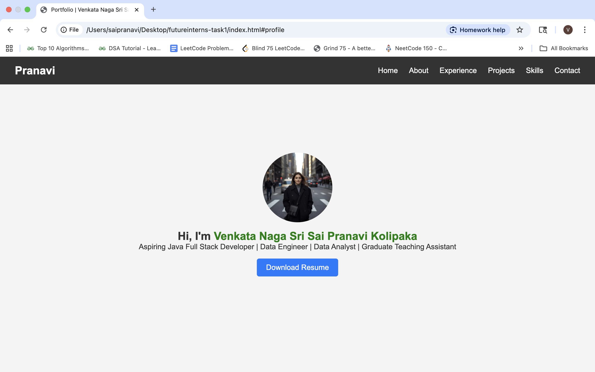
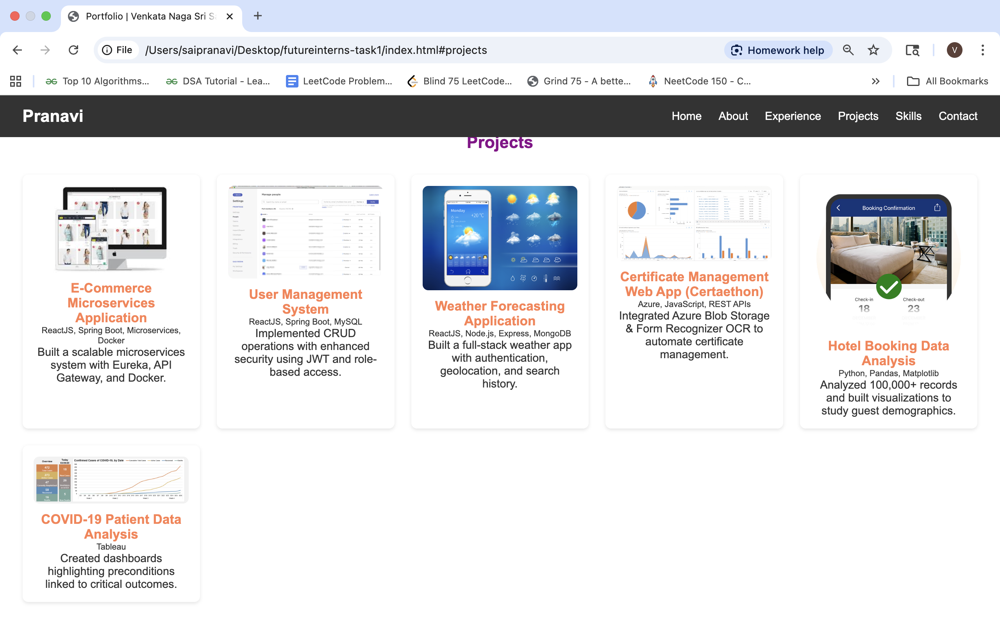
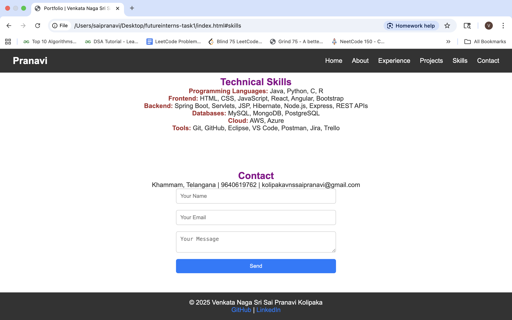

# Portfolio Task 1 - Personal Portfolio Website

## Overview
This is a **personal portfolio website** built with **HTML, CSS, and JavaScript**.  
It showcases my profile, about section, experience, projects, contact information, and footer, along with responsive design for mobile and desktop.

The design and structure are inspired by a popular YouTube portfolio tutorial and customized for my own content.

---

## Features
- **Responsive Navbar** with desktop and mobile views
- **Profile Section**: Displays my photo, name, and a brief introduction
- **About Section**: Highlights my skills and interests
- **Experience Section**: Lists work experience and internships
- **Projects Section**: Showcases personal projects
- **Contact Form**: Allows users to reach out via email
- **Footer Section**: Displays copyright information
- **Responsive Design** using media queries for mobile devices

---

## Technologies Used
- HTML5
- CSS3 (Flexbox, Grid, Media Queries)
- JavaScript (DOM Manipulation)
- Responsive Design principles

---

## Folder Structure

```plaintext
portfolio-task1/
├── index.html
├── css/
│   └── responsive.css
│   └── style.css
├── js/
│   └── main.js
│   └── menu.js
├── assets/
│   ├── certeathon.png
│   └── covid19.png
│   └── ecommerce.jpeg
│   └── hotel-booking.jpg
│   └── profile.png
│   └── resume.pdf
│   └── user-management.png
│   └── weather.png
```

---

## How to Run
1. Clone the repository:
```bash
git clone https://github.com/Pranavi2002/FUTURE_FS_01.git
```

2. Open `index.html` in your browser.

---

## Screenshots


! [AboutMe-WorkExperience](screenshots/about-experience.png)



---

## Live Demo

Check out the live portfolio here: [Netlify Link](https://your-netlify-link.netlify.app)

---

## Deployment

This project can be deployed on **Netlify**, **Vercel**, or **GitHub Pages**.
For Netlify:

1. Go to [Netlify](https://www.netlify.com/) → New site → Deploy manually
2. Drag and drop the project folder
3. Your portfolio will be live with a public URL

---

## 👩‍💻 Author
### Pranavi Kolipaka
Feel free to connect: 
- [LinkedIn] (https://www.linkedin.com/in/vns-sai-pranavi-kolipaka-489601208/) 
- [GitHub] (https://github.com/Pranavi2002)

---

## License

This project is open-source and free to use.
